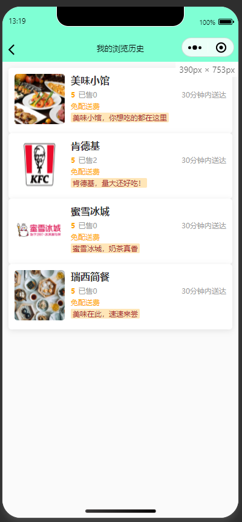
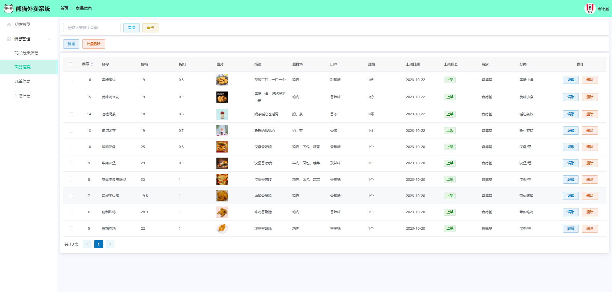

# 基于Java+SpringBoot+Vue外卖订餐小程序(源码+数据库)

### 作者QQ：3275035005 微信：xkbishe123 (支持修改、 部署调试、 代做接毕业设计和课程设计)

### 网站建设、小程序、H5、APP、各种系统、样式修改、10000套源码可选。

### 选题+开题报告+任务书+程序定制+安装调试+论文+答辩ppt 都可以做

### 问题包修改，包满意，有需求尽管甩过来！一条龙帮你安心过！

### 所有项目以及源代码本人均调试运行无问题 可支持远程调试运行

# 项目介绍
基于Java+SpringBoot+Vue外卖订餐小程序-毕业设计，本系统分小程序端、管理端、商家端三部分，项目采用前后端分离开发

### 1. 用户

- 用户登录注册
- 首页轮播图广告信息
- 首页公告信息
- 首页商家推荐
- 商品加入购物车
- 商品下单
- 订单评价
- 我的订单中心
- 个人信息修改
- 我的收货地址
- 我的评价中心
- 我的浏览历史
- 查看用户协议
- 查看关于我们
- 退出登录

### 2. 管理员

- 管理员登录
- 系统首页公告
- 商品分类信息管理
- 商品信息管理
- 广告信息管理
- 订单信息管理
- 收藏信息管理
- 评论信息管理
- 公告信息管理
- 管理员信息管理
- 商家信息管理
- 用户信息管理
- 个人信息修改
- 密码修改
- 退出登录

### 3. 商家

- 商家登录
- 系统首页公告
- 商品分类信息管理
- 商品信息管理
- 订单信息管理
- 评论信息管理
- 个人信息修改
- 密码修改
- 退出登录

# 技术框架
- 开发语言：Java8
- 数据库：Mysql5.7以上
- 系统环境：jdk8、maven、node
- 后端框架：SpringBoot、MyBatisplus、MyBatis
- 前端框架：Vue、Elementui
- 小程序：Uniapp
- 工具：IDEA、Navicat、HBuilder、微信开发者工具
- 技术架构：前后端分离、B/S架构、MVC架构
# 项目截图

### 1. 用户端

### 2. 管理端

### 2. 管理端

